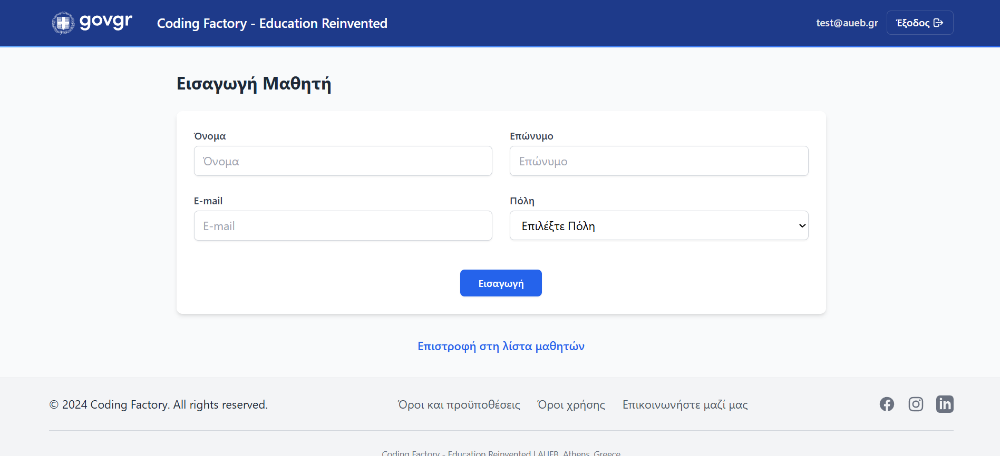

# schoolapp-servlets-jsp
This is a Java JSP application project developed for educational purposes. 
An SSR (Server Side Rendering) app with session-based authentication. 
To run the app, a mySQL database setup is required. 

Gov.gr Logo source: [Gov.gr logo on Wikimedia Commons](https://el.wikipedia.org/wiki/%CE%91%CF%81%CF%87%CE%B5%CE%AF%CE%BF:Gov.gr_logo.png)

## 📸 Screenshots

# Landing Page

# Login Page

# Dashboard

# Students Page

# Student Insert Page

